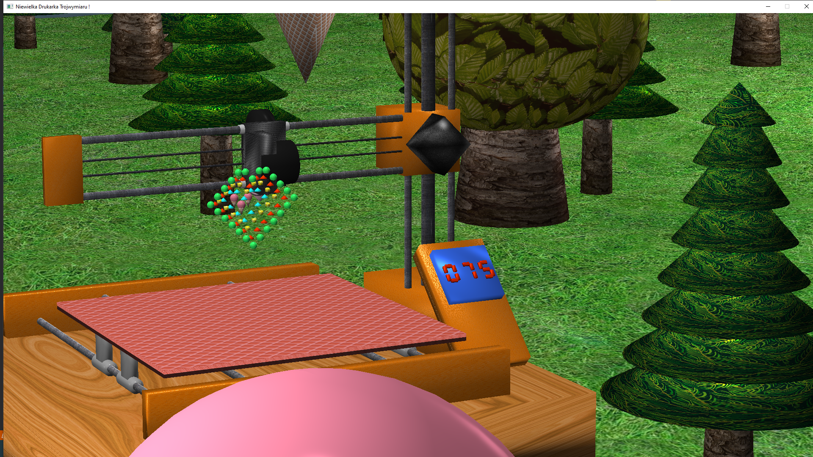

# Drukarka 3D
Projekt drukarki 3d

# Skład

* Sebastian Aksamit
* Kamil Zacharczuk
* Przemysław Stawczyk

# Kamienie milowe

1. Przygotowanie szkicu modelu drukarki
2. Przygotowanie struktury projektu
3. Przygotowanie bazowych obiektów do konstrukcji modeli i ich grupowania
4. Bazowe modele takie jak sfera, kostka, stożek
5. Obsługa kamery i jej przemieszczania
6. Bazowa obsługa świateł
7. Obsługa tekstur i materiałów
8. Modele elementów drukarki
9. Animacja elementów drukarki
10. Proceduralne generowanie otoczenia : lasu i pofałdowanego terenu 

# Funkcjonalności

- Konstruowanie pięciu prymitywów
    - stożek, cylinder, sfera, kostka, prostopadłościan
- Funkcjonalna drukarka
    - Drukowanie prymitywów i lodów
    - Licznik obiektów
    - Możliwość usunięcia wszystkich wydrukowanych obiektów
    - Poruszanie ramieniem, dyszą, tacką
- Oświetlenie
    - Możliwość prostego dodawania źródeł światła globalnego, punktowego i kierunkowego
    - Funkcjonalna latarka
- Otoczenie
    - Proceduralnie generowane otoczenie : las, teren...
    - skybox
- Materiały
    - Mapa dyfuzyjna i mapa odbić, każda z osobnym stopniem mieszania z kolorem obiektu
    - Parametr błyszczenia
- Kamera
    - Przemieszczanie w trzech wymiarach
    - Przybliżanie i oddalanie widoku

# Podział zadań

## Przemysław Stawczyk aka PrzeStaw
- stworzenie bazowego projektu
- opracowanie koncepcji i implementacji hierarchii obiektów - na przykładzie stożka
- opracowanie obsługi tekstur
- opracowanie modelu drukarki i jej animacji [w tym dodawnia obiektów]
- opracowanie modeli loda, drzew oraz generowania losowego lasu
- oteksturowanie wykonanych modeli

## Sebastian Aksamit aka Temebe 
- opracowanie kamery
- opracowanie obsługi przycisków
- opracowanie obsługi oświetlenia
- obsługa materiałów
- stworzenie shaderów

# Kamil Zacharczuk aka KamZet
- implementacja prymitywów sfery i kostki
- implementacja skyboxa
- implementacja wyświetlacza
- zamodelowanie latarni
- generowanie proceduralne terenu

# Sterowanie

- spawnowanie obiektów :
	- 1 : wydrukowanie kuli
	- 2 : wydrukowanie stożka
	- 3 : wydrukowanie kostki
	- 4 : wydrukowanie cylindra
	- 5 : wydrukowanie loda
	- 0 : usunięcie wydrukowanych obiektów

- sterowanie kamerą :
	- W : przemieszczenie kamery "do przodu"
	- A : przemieszczenie kamery "w lewo"
	- S : przemieszczenie kamery "do tyłu"
	- D : przemieszczenie kamery "w prawo"
	- Ruch myszem w lewo : obrót kamery w lewą stronę
	- Ruch myszem w prawo : obrót kamery w prawą stronę
	- Ruch myszem w dół : obrót kamery w górę
	- Ruch myszem w górę : obrót kamery w dół
	- Kółko mysza w górę : przybliżenie widoku
	- Kółko mysza w dół : oddalenie widoku

- sterowanie drukarką:
	- Strzałka w lewo : przemieszczenie dyszy w lewo
	- Strzałka w prawo : przemieszczenie dyszy w praow
	- Strzałka w dół : przemieszczenie ramienia w dół
	- Strzałka w górę : przemieszczenie ramienia w górę
	- O : przemieszczenie podstawy do przodu
	- L : przemieszczenie podstawy do tyłu

- różne:
	- F : włączenie/wyłączenie latarki
	- Esc : zamknięcie programu

# Obrazek poglądowy projektu

# Zdjęcie przykładowe inspiracji

# Źródła

www.it.hiof.no/~borres/j3d/explain/light/p-materials.html
learnopengl.com
www.custommapmakers.org/skyboxes.php