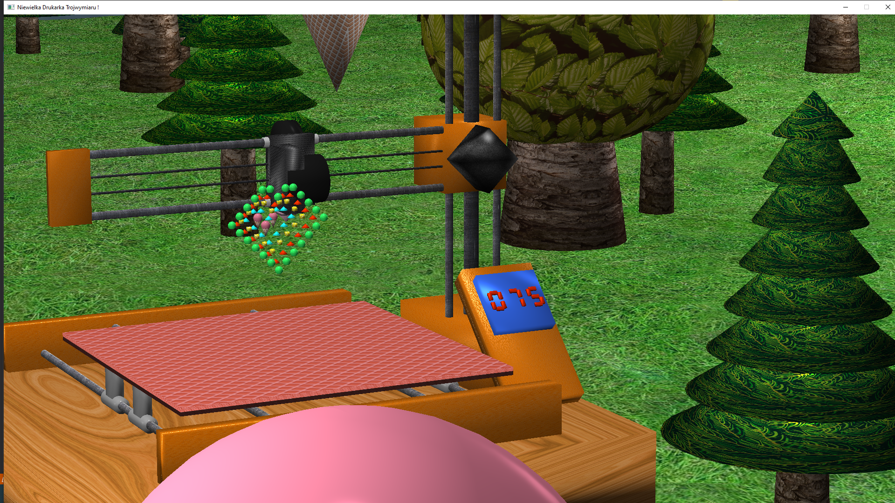
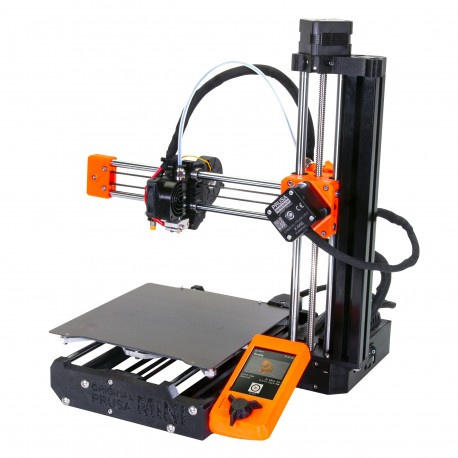

# 3d printer OpenGL project

## Instructions of navigation / Sterowanie

- spawnowanie obiektów :
	- 1 : wydrukowanie kuli
	- 2 : wydrukowanie stożka
	- 3 : wydrukowanie kostki
	- 4 : wydrukowanie cylindra
	- 5 : wydrukowanie loda
	- 0 : usunięcie wydrukowanych obiektów

- sterowanie kamerą :
	- W : przemieszczenie kamery "do przodu"
	- A : przemieszczenie kamery "w lewo"
	- S : przemieszczenie kamery "do tyłu"
	- D : przemieszczenie kamery "w prawo"
	- Ruch myszem w lewo : obrót kamery w lewą stronę
	- Ruch myszem w prawo : obrót kamery w prawą stronę
	- Ruch myszem w dół : obrót kamery w górę
	- Ruch myszem w górę : obrót kamery w dół
	- Kółko mysza w górę : przybliżenie widoku
	- Kółko mysza w dół : oddalenie widoku

- sterowanie drukarką:
	- Strzałka w lewo : przemieszczenie dyszy w lewo
	- Strzałka w prawo : przemieszczenie dyszy w praow
	- Strzałka w dół : przemieszczenie ramienia w dół
	- Strzałka w górę : przemieszczenie ramienia w górę
	- O : przemieszczenie podstawy do przodu
	- L : przemieszczenie podstawy do tyłu

- różne:
	- F : włączenie/wyłączenie latarki
	- Esc : zamknięcie programu

# Example pictures / Obrazek poglądowy projektu




# Functionalities / Funkcje

- Konstruowanie pięciu prymitywów
    - stożek, cylinder, sfera, kostka, prostopadłościan
- Funkcjonalna drukarka
    - Drukowanie prymitywów i lodów
    - Licznik obiektów
    - Możliwość usunięcia wszystkich wydrukowanych obiektów
    - Poruszanie ramieniem, dyszą, tacką
- Oświetlenie
    - Możliwość prostego dodawania źródeł światła globalnego, punktowego i kierunkowego
    - Funkcjonalna latarka
- Otoczenie
    - Proceduralnie generowane otoczenie : las, teren...
    - skybox
- Materiały
    - Mapa dyfuzyjna i mapa odbić, każda z osobnym stopniem mieszania z kolorem obiektu
    - Parametr błyszczenia
- Kamera
    - Przemieszczanie w trzech wymiarach
    - Przybliżanie i oddalanie widoku

## Build instructions

Project is build by CMake build system. You must import submodules to make this working.
```
git clone --recursive git@github.com:przestaw/OpenGL-3d-Printer.git
```
or after clone
```
git submodule init
git submodule update
```

Old project developed at university is available at *UniversityProject* branch utilizing Visual Studio to build project.

## Developers

* [Przemysław Stawczyk](https://github.com/przestaw)
* [Sebastian Aksamit](https://github.com/Temebe)
* [Kamil Zacharczuk](https://github.com/KamZet)

## Inspired by / Zdjęcie przykładowe inspiracji



## Sources / Źródła

www.it.hiof.no/~borres/j3d/explain/light/p-materials.html
learnopengl.com
www.custommapmakers.org/skyboxes.php
